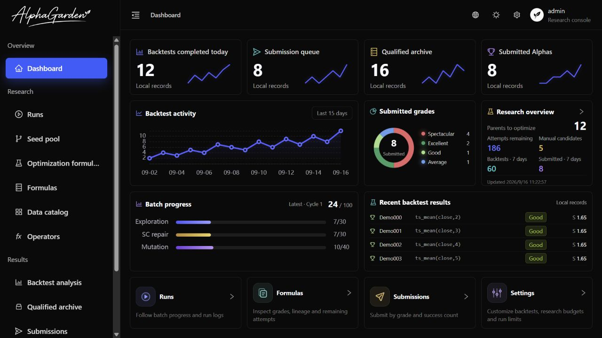
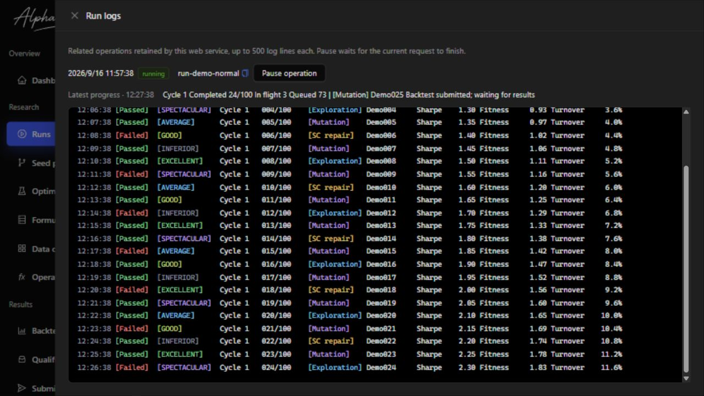
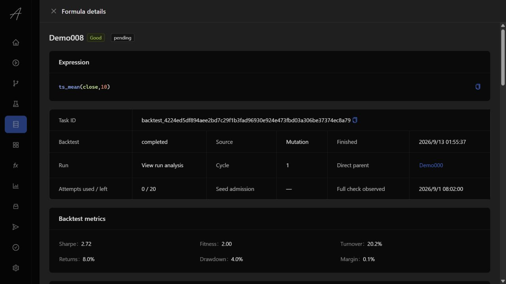
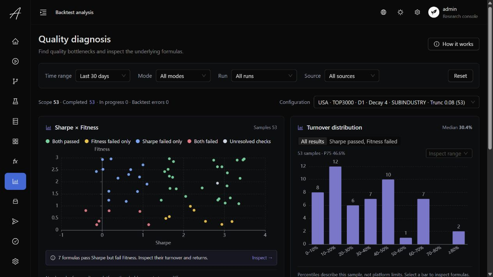
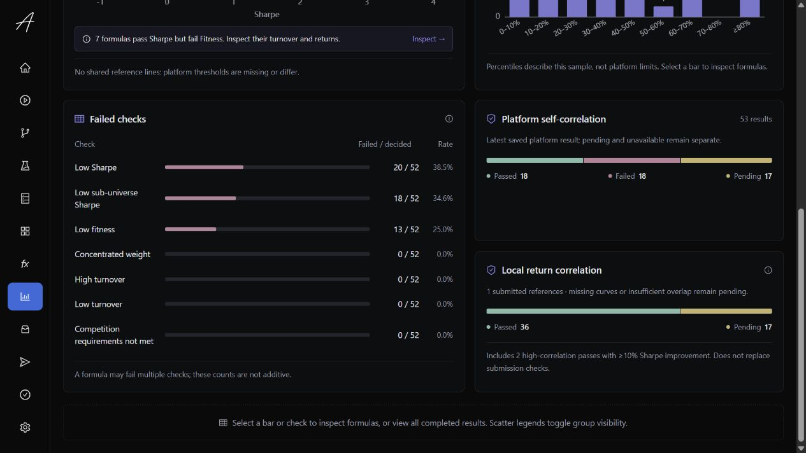
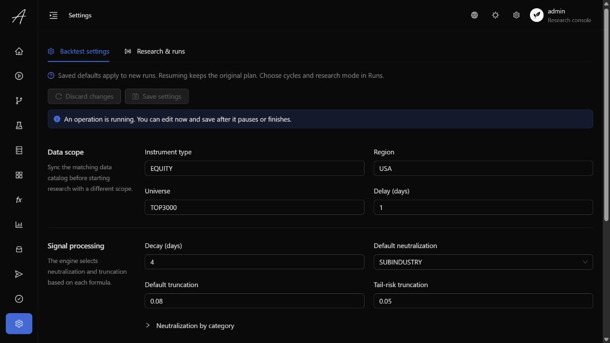

# Alpha Garden

**Grow formulas into research you can inspect, improve, and build on.**

**English** · [简体中文](README.zh-CN.md)

Alpha Garden is a local research workspace for **WorldQuant BRAIN**, combining a Python research engine with a bilingual web console. Set your research budget and run limits, explore new formulas, test mutations, inspect the evidence, and manage qualified results in one place.

**Python · React · TypeScript · Ant Design · ECharts · SQLite**

[Features](#features) · [Interface tour](#interface-tour) · [Quick start](#quick-start) · [Research rules](#research-rules) · [Development](#development)

> The screenshots below show the current frontend running with isolated, synthetic demonstration data. Formula expressions, metrics, curves and logs are examples—not real account records or evidence of investment performance. The regular application reads your configured research database; it does not substitute demo data.



## Features

| Workspace | What you can do |
| --- | --- |
| **Dashboard** | Follow 15-day backtest activity, submitted grades, available optimization attempts, batch progress and recent results. |
| **Runs** | Start normal research or focused optimization, choose the number of cycles, inspect live logs, pause and resume an existing plan. |
| **Seed pool & optimization** | Browse admitted seeds and active branches, follow lineage, and track each formula's remaining mutation attempts. |
| **Formulas** | Search started backtests, inspect grades and checks, and open formula details without losing your place in the list. Unsent candidates stay in run details. |
| **Backtest analysis** | Diagnose quality through Sharpe/Fitness, turnover, failed checks and separate platform/local correlation evidence. Drill into the matching formulas. |
| **Qualified archive & submissions** | Review currently eligible archived formulas, submit individually or by grade and successful count, and inspect submission history. |
| **Data catalog & operators** | Search synchronized fields and operators, inspect descriptions, coverage, definitions and parameters. |
| **Settings** | Customize backtest defaults, research allocation, budgets, concurrency and failure limits. |

The console supports **Chinese and English**, **dark and light themes**, and live progress updates. Both the web interface and CLI use the same research engine and local records.

## Interface tour

### Run logs

A black terminal view keeps timestamps, check outcomes, platform grades, sources and metrics aligned. Colored messages distinguish results and research phases; the latest in-flight progress appears above the log.



The console retains up to **500 lines per operation** for the current web-service session. These logs are temporary; restarting the service clears them without removing persisted research results. Log statuses, sources, stages and live progress follow the selected Chinese or English language. Platform error messages and error codes retain their original text.

### Formula details

Inspect the expression, backtest metrics, recorded checks, annual results and mutation history. PnL, Sharpe and Turnover curves have separate tabs. Parent and descendant links open another detail layer, preserving the current drawer and list state.



In normal service mode, opening a detail requests PnL; the other curves load when selected. Read-only mode shows saved evidence and does not fetch platform curves. Missing data stays unavailable rather than becoming a fabricated result.

### Quality diagnosis

Filter by time, research mode, run, source and backtest configuration. Toggle scatter groups, inspect turnover ranges, and open the formulas behind a failed check. Platform self-correlation and local return correlation remain separate, with pending and unavailable evidence clearly identified.



<details>
<summary>View failed checks and correlation evidence</summary>



A formula can fail more than one check, so failure counts are not additive. Reference lines use recorded platform thresholds and are omitted when thresholds are missing or inconsistent. Analysis summarizes saved results; it does not start research or submit formulas.

</details>

### Editable run settings

Backtest settings and research/run settings have separate forms. Saved defaults apply to new runs; resuming a run keeps its original plan. While an operation is active, changes can be edited and saved after it pauses or finishes.

<details>
<summary>View the settings interface</summary>



</details>

## Quick start

### 1. Prepare the environment

- **Python 3.11+** for the research engine.
- **Node.js 24 and pnpm 11** for the frontend build.
- A **WorldQuant BRAIN account** with access to the data and operations you intend to use.

The following examples use PowerShell from the repository root. A Python virtual environment is recommended.

```powershell
python -m pip install --no-deps -e .
if (-not (Test-Path .env)) { Copy-Item .env.example .env }
```

### 2. Configure and initialize

Edit `.env` using [.env.example](.env.example): set a stable `WQB_ACCOUNT_SCOPE` and the required authentication values (`WQB_EMAIL` / `WQB_PASSWORD`, or `WQB_SESSION_TOKEN`). Keep credentials out of Git.

Review [backtest defaults](config/backtest.default.json) and [research defaults](config/run.default.json), then initialize:

```powershell
alpha-garden init
```

Initialization prepares the local database and research definitions. If a complete matching data catalog is unavailable, it authenticates with WorldQuant BRAIN and synchronizes fields and operators. It does not start backtests or submit formulas. Keep existing configuration and research data when updating the project.

### 3. Build and open the console

```powershell
pnpm --dir webui install --frozen-lockfile
pnpm --dir webui build
alpha-garden web
```

Open **[http://127.0.0.1:8787](http://127.0.0.1:8787/)** and sign in with the local console account **`admin` / `123123`**. This account is separate from your WorldQuant credentials.

The Python service serves both the built frontend and API. Starting the service or signing in does not start research or submit formulas. The console binds to loopback and is intended for local, single-account use.

To browse without enabling operations or requesting platform curves:

```powershell
alpha-garden web --read-only
```

### 4. Start researching

1. Review **Settings** and choose your research budget and limits.
2. Open **Runs**, choose normal research or focused optimization, and set the number of cycles.
3. Follow **Logs** and inspect results in **Formulas** or **Backtest analysis**.
4. Review eligible results in **Qualified archive** or **Submissions** before submitting.

New runs started from the console have **automatic submission disabled**. Closing the browser does not stop a run; use Pause to stop at an execution boundary and Resume to continue the saved plan.

## CLI workflow

| Action | Command |
| --- | --- |
| Run one cycle | `alpha-garden run` |
| Run five cycles | `alpha-garden run 5` |
| Optimize qualified formulas | `alpha-garden run -opt` |
| Resume an existing plan | `alpha-garden resume <run_id>` |
| Submit two formulas from the Spectacular queue | `alpha-garden submit 2` |
| Submit two currently eligible Good formulas | `alpha-garden submit good 2` |
| Open the local console | `alpha-garden web` |

Grade-based submission also supports `average`, `excellent` and `inferior`. Omitting the count processes eligible candidates selected at launch. Counts mean **successful submissions**: fresh-check failures are skipped, insufficient candidates end the operation early, and uncertain outcomes are reconciled before another request is sent.

Backtesting does not submit by default. CLI runs can explicitly enable automatic submission; inspect `alpha-garden run --help` before choosing run options.

## Research rules

**Normal research** combines exploration, mutation and self-correlation repair. **Focused optimization** works on fully checked active parents below the target grade with attempts remaining. The target is the platform's **Spectacular** grade; optimization explores the possibility of improvement, without guaranteeing it.

- Each formula has up to **20 mutation attempts**, shared across both modes. Switching modes does not reset the budget.
- Better qualifying descendants can take over using their own remaining attempts. Replaced formulas and their research history remain recorded.
- The **qualified archive** lists currently submittable retained formulas. A replaced formula does not have to exhaust all 20 attempts first.
- Local evidence helps select candidates and preserve improvement opportunities. **Platform checks remain required before formal submission.**

<details>
<summary>Correlation screening, the 10% improvement rule, and near duplicates</summary>

Local submission screening compares daily PnL increments against every recorded submitted Alpha for the same account, using at least **252 matching intervals**. Correlation **≥ 0.7** requires Sharpe at least **10% higher** than that reference. Missing curves, insufficient overlap or a required missing Sharpe keep eligibility pending.

Candidate ordering also protects fully checked formulas still being optimized and preserves successive improvement opportunities. For highly correlated Sharpes of **1.50 → 1.60 → 1.70**, with 1.70 still being optimized, the selector can offer 1.50 first and defer 1.60. It replans after every confirmed submission; local screening never substitutes for live platform checks.

Focused optimization converges near duplicates within the same account, lineage and backtest settings. At least 252 matching daily PnL intervals and correlation **≥ 0.9999** are required. Representatives are selected by grade, Sharpe, Fitness, then earliest completion; missing historical grades do not establish cross-grade preference. The representative keeps its own remaining budget, and exhaustion does not reactivate equivalent descendants with fresh budgets. Missing, short or undefined correlations are not duplicate evidence. Original formulas, results and mutation history are retained.

</details>

## Local data and development

Research records live in `data/alpha_garden.sqlite3`; account configuration lives in `.env`. Credentials, local databases, logs, model artifacts and the generated submitted-formula list are excluded from Git. Use synthetic data when sharing screenshots that would otherwise reveal research expressions or account records.

| Area | Location |
| --- | --- |
| Python research engine, platform client and local web API | [src/](src/) |
| React console and frontend development guide | [webui/](webui/README.md) |
| Backtest policy and research defaults | [config/](config/) |
| Python verification suites | [tests/](tests/) |
| Bilingual demonstration screenshots | [assets/screenshots/](assets/screenshots/) |

<a id="development"></a>
For frontend development, run the read-only backend in one terminal and the Vite development server in another:

```powershell
# Terminal 1 — repository root
alpha-garden web --read-only

# Terminal 2 — repository root
pnpm --dir webui dev
```

Open **[http://127.0.0.1:5173](http://127.0.0.1:5173/)**. Vite proxies `/api` to the local backend on port 8787. Run `pnpm --dir webui lint` and `pnpm --dir webui build` for frontend checks. See the [frontend guide](webui/README.md) for API boundaries, configuration and detailed behavior.

## License

[MIT](LICENSE). The project is shared as-is; ongoing maintenance and support are not guaranteed.
