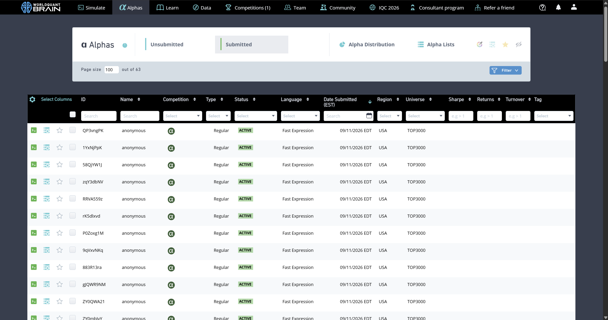

# Alpha Garden

**English** | [简体中文](README.zh-CN.md)

**Keep exploring new formulas and put promising ideas to the test.**

Alpha Garden automates formula research on WorldQuant BRAIN. You set the research scale and number of rounds; the system generates formulas, runs backtests, compares results, and continues exploring promising directions.

The aim is to build on what each round reveals: promising formulas get a chance to improve, previous results inform the next round, and qualified formulas are retained when further attempts produce no improvement.



## What it helps you do

- **Find new research directions.** Explore different data fields and formula structures to discover new starting points.
- **Improve existing formulas.** Generate variations of promising formulas, test them through real backtests, and use the results to decide what to pursue.
- **Address correlation issues.** Try targeted changes based on self-correlation conflicts reported by the platform, weighing changes in correlation against their effect on performance.
- **Organize research results.** Keep track of formulas that need further optimization, are ready for submission, or should be retained for later. Successful submissions are collected in a separate list.

## Aiming for Spectacular

Alpha Garden prioritizes formulas rated **Spectacular** by WorldQuant BRAIN. Before submission, they must also pass the platform's full set of checks, including self-correlation.

Formulas that pass all checks but fall below the target rating can continue through optimization. Each formula has up to **20 mutation attempts**. If a stronger qualifying descendant emerges, it takes over using its own remaining attempts.

Qualified formulas that exhaust their attempts without reaching the target are kept in the qualified archive for later submission by rating. Qualified formulas replaced by stronger descendants are also retained, but submission by rating only selects formulas that have used all 20 of their own attempts.

## Two ways to research

| What you want to do | Research mode |
| --- | --- |
| Find new formulas while improving existing ideas | Standard backtesting combines exploration, mutation, and self-correlation work |
| Focus on improving qualified formulas | Targeted optimization works on formulas that pass all checks, fall below the target rating, and still have attempts remaining |

Both modes share each formula's 20 attempts. Switching modes does not reset them. You can run one round or several consecutive rounds; the system proceeds with the candidates available.

## Everyday use

Once initial setup is complete, a few commands cover the usual tasks:

| What you want to do | Command |
| --- | --- |
| Run one round | `alpha-garden run` |
| Run 5 consecutive rounds | `alpha-garden run 5` |
| Focus on optimizing qualified formulas | `alpha-garden run -opt` |
| Submit 2 formulas from the Spectacular queue | `alpha-garden submit 2` |
| Submit 2 Good formulas from the qualified archive whose attempts are exhausted | `alpha-garden submit good 2` |

Choose any positive count. Submission by rating also supports `average`, `excellent`, and `inferior`. If you omit the count, the command processes all eligible candidates selected at launch.

The submission count measures **successful submissions**. A formula that fails a fresh check is skipped, and the command finishes early if there are too few eligible candidates. If a submission result is still unknown, the system checks the existing request before proceeding, avoiding duplicate submissions.

<details>
<summary>First-time setup: installation and account configuration</summary>

You need Python 3.11 or later and an account with access to WorldQuant BRAIN. Run these commands from the project directory:

```powershell
python -m pip install --no-deps -e .
if (-not (Test-Path .env)) { Copy-Item .env.example .env }
```

Use [.env.example](.env.example) as a guide to fill in the account scope and authentication settings in `.env`, then initialize:

```powershell
alpha-garden init
```

Keep any existing configuration and research data.

</details>

## Follow the research as it runs

During a run, you can see progress alongside each formula's source, rating, key metrics, and check results. A formula marked as passing the basic backtest must still complete the platform's submission checks.

Successful submissions are automatically collected in a list for easy reference. It contains formula IDs, submission times, and brief metrics, without formula expressions. Account configuration, research data, and the results list are excluded from Git.

Backtesting does not submit formulas by default. You can submit results yourself after reviewing them, or explicitly enable automatic submission when starting a run. Common request failures have retry and recovery handling. If an account issue needs attention or a submission result needs confirmation, the system preserves its progress and reports the situation.

## License

The source code is available under the [MIT License](LICENSE). The project is shared as-is; ongoing maintenance and support are not guaranteed.
