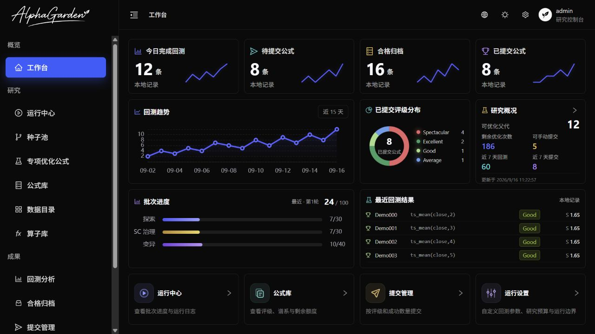
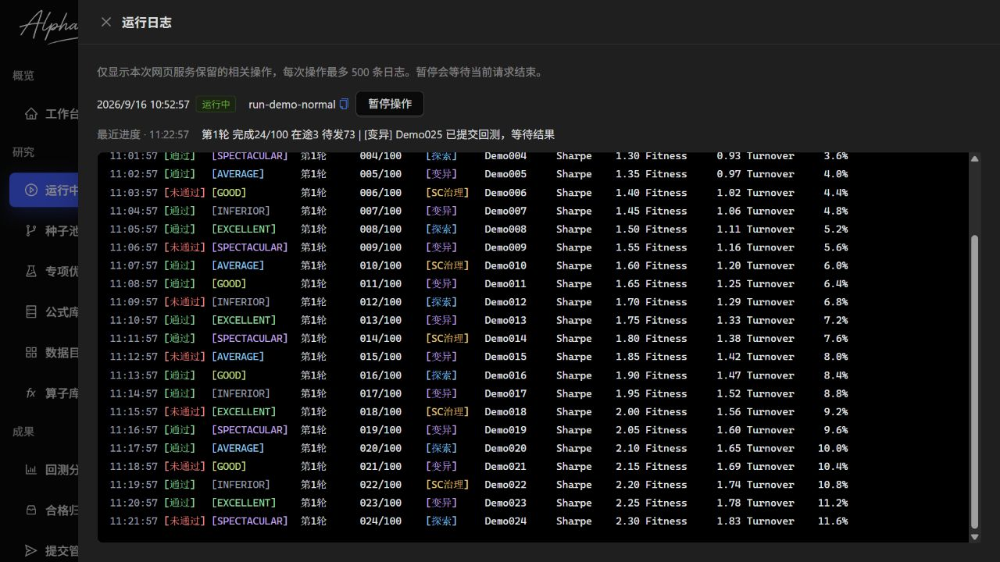
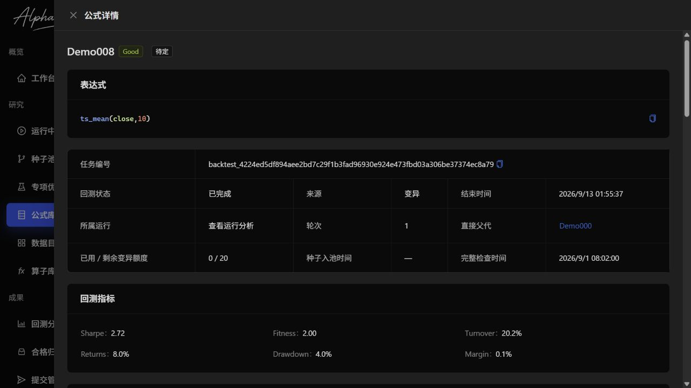
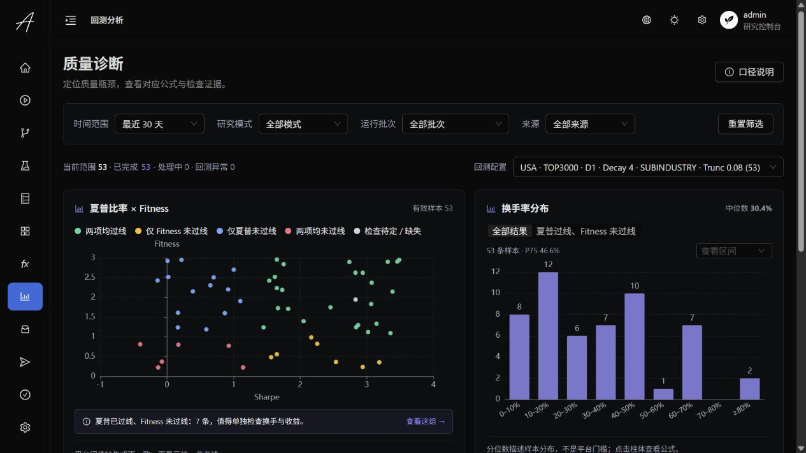
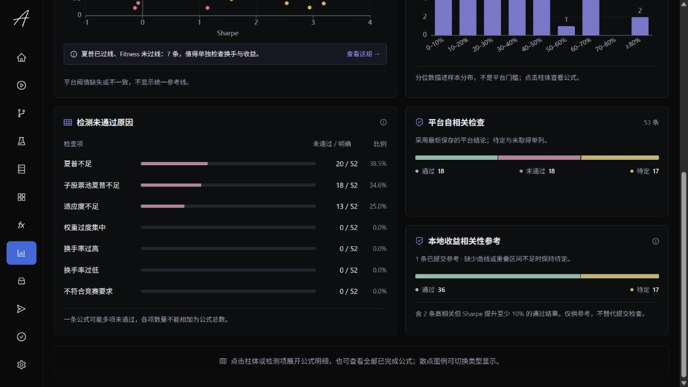
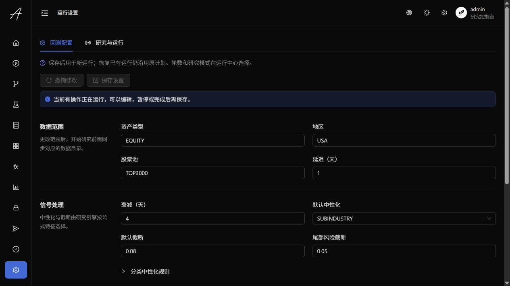

# Alpha Garden

**让公式成为可观察、可改进、可积累的研究资产。**

[English](README.md) · **简体中文**

Alpha Garden 是面向 **WorldQuant BRAIN** 的本地公式研究工作台，将 Python 研究引擎与中英文网页控制台结合起来。你确定研究预算和运行边界，系统负责探索公式、验证变异、积累证据，并集中管理合格结果。

**Python · React · TypeScript · Ant Design · ECharts · SQLite**

[功能概览](#功能概览) · [界面导览](#界面导览) · [快速开始](#快速开始) · [研究规则](#研究规则) · [开发说明](#开发说明)

> 下方截图来自当前前端与隔离的示例环境。公式表达式、指标、曲线和日志均为合成示例，不包含真实账号研究记录，也不代表实际投资表现。正常运行的应用读取你配置的研究数据库，不会用示例数据替代真实结果。



## 功能概览

| 工作区 | 可以做什么 |
| --- | --- |
| **工作台** | 查看近 15 天回测趋势、已提交评级分布、剩余优化机会、批次进度和最近结果。 |
| **运行中心** | 启动普通回测或专项优化、设置轮数、查看实时日志，暂停并恢复已有计划。 |
| **种子池与专项优化** | 查看已入池种子和活动研究分支，追溯父子关系，跟踪每条公式的剩余变异机会。 |
| **公式库** | 查询已进入回测的公式，查看评级与检查结果，在保留列表状态的同时打开详情。未发送的候选保留在运行详情中。 |
| **回测分析** | 从 Sharpe / Fitness、换手率、未通过检测和平台／本地相关性定位质量问题，继续查看对应公式。 |
| **合格归档与提交** | 查看当前可提交的归档公式，按单条或评级与成功数量提交，追踪提交记录。 |
| **数据目录与算子库** | 检索已同步字段和算子，查看描述、覆盖率、定义及参数。 |
| **运行设置** | 自定义回测参数、研究比例、预算、并发数量和故障边界。 |

网页支持**中英文切换、深浅色主题和实时进度更新**。前端与命令行复用同一套研究引擎和本地记录。

## 界面导览

### 运行日志

黑色终端背景配合彩色状态，将时间、检查结果、平台评级、来源和指标按列对齐。研究阶段与回测结果分色显示，日志上方展示最新在途进度。



当前网页服务为每次操作最多保留 **500 条日志**。这些日志是临时记录，重启服务后清空，但不会删除已经保存的研究结果。页面提供中英文界面，引擎原始日志目前仍为中文。

### 公式详情

集中查看表达式、回测指标、已保存检查、年度表现与变异历史，按页签切换 PnL、Sharpe 和 Turnover 曲线。点击父代或后代会打开新的详情层，关闭后仍回到原来的详情和列表位置。



普通服务模式下，打开详情会请求 PnL，其他曲线在选中对应页签时加载。只读模式仅展示已有证据，不获取平台曲线。缺失数据保持缺失，不补造结果。

### 质量诊断

按时间、研究模式、运行批次、来源和回测配置筛选，切换散点类型、查看换手区间，并从未通过检测下钻到公式明细。平台自相关与本地收益相关性分别展示，待定和未取得的证据单独标识。



<details>
<summary>查看未通过原因与相关性检查</summary>



一条公式可能有多项未通过，因此各项数量不能直接相加。参考线使用保存的平台阈值，阈值缺失或不一致时不显示统一参考线。分析页面汇总已有结果，不会启动研究或提交公式。

</details>

### 可编辑的运行设置

回测配置与研究运行配置分开编辑、保存。新设置用于后续新运行，恢复已有运行继续沿用原计划。有操作进行时可以先编辑，待暂停或结束后再保存。

<details>
<summary>查看运行设置界面</summary>



</details>

## 快速开始

### 1. 准备环境

- **Python 3.11+**：运行研究引擎。
- **Node.js 24 与 pnpm 11**：构建前端。
- **WorldQuant BRAIN 账号**：具备所用数据和操作的访问权限。

以下示例使用 PowerShell，在仓库根目录执行。建议使用 Python 虚拟环境。

```powershell
python -m pip install --no-deps -e .
if (-not (Test-Path .env)) { Copy-Item .env.example .env }
```

### 2. 配置并初始化

参照 [.env.example](.env.example) 编辑 `.env`：设置稳定的 `WQB_ACCOUNT_SCOPE`，并填写所需认证信息（`WQB_EMAIL` / `WQB_PASSWORD`，或 `WQB_SESSION_TOKEN`）。不要将凭据提交到 Git。

检查[回测默认配置](config/backtest.default.json)和[研究默认配置](config/run.default.json)，然后初始化：

```powershell
alpha-garden init
```

初始化会准备本地数据库与研究定义。如果缺少完整且匹配的数据目录，会认证 WorldQuant BRAIN 并同步字段和算子，不会启动回测或提交公式。更新项目时保留已有配置和研究数据。

### 3. 构建并打开网页

```powershell
pnpm --dir webui install --frozen-lockfile
pnpm --dir webui build
alpha-garden web
```

打开 **[http://127.0.0.1:8787](http://127.0.0.1:8787/)**，使用本地控制台账号 **`admin` / `123123`** 登录。它与 WorldQuant 账号相互独立。

Python 服务同时提供前端页面和接口。启动服务或登录不会启动研究或提交公式。控制台仅监听本机回环地址，面向本地单账号使用。

只查看数据，不启用操作和平台曲线请求时：

```powershell
alpha-garden web --read-only
```

### 4. 开始研究

1. 在**运行设置**中确认研究预算与边界。
2. 在**运行中心**选择普通回测或专项优化，设置轮数并开始运行。
3. 查看**运行日志**，在**公式库**或**回测分析**中检查结果。
4. 在**合格归档**或**提交管理**中查看符合条件的公式，再执行提交。

网页新启动的运行**不自动提交公式**。关闭浏览器不会停止运行；使用暂停按钮让引擎在执行边界停止，再通过恢复继续原计划。

## 命令行使用

| 操作 | 命令 |
| --- | --- |
| 运行一轮 | `alpha-garden run` |
| 连续运行五轮 | `alpha-garden run 5` |
| 专项优化合格公式 | `alpha-garden run -opt` |
| 恢复已有计划 | `alpha-garden resume <run_id>` |
| 从 Spectacular 队列成功提交两条 | `alpha-garden submit 2` |
| 成功提交两条当前符合条件的 Good 公式 | `alpha-garden submit good 2` |
| 打开本地控制台 | `alpha-garden web` |

按等级提交也支持 `average`、`excellent`、`inferior`；省略数量时处理启动时选出的符合条件的候选。数量按**成功提交条数**计算：复检不通过会跳过，候选不足时提前结束，结果不明确时先确认已有请求，再决定后续操作。

回测默认不提交。命令行运行可以显式开启自动提交，选择运行参数前可查看 `alpha-garden run --help`。

## 研究规则

**普通回测**结合探索、变异和自相关性治理；**专项优化**围绕检查完整通过、评级不足且仍有额度的活动父代继续尝试。目标是平台评定的 **Spectacular** 等级；优化用于探索提升的可能性，不保证一定提高等级。

- 每条公式最多 **20 次变异机会**，两种模式共享，切换模式不重置。
- 更优的合格后代可以接替研究，使用自己的剩余机会；被接替公式与研究历史继续保留。
- **合格归档**展示当前可提交的保留公式。被更优后代接替的公式，不必再等自身 20 次机会用完。
- 本地证据用于筛选候选、保护后续改善机会，**正式提交前仍需平台检查**。

<details>
<summary>相关性筛选、10% 改善条件与近重复收敛</summary>

本地提交筛选会与同账号已记录的全部已提交公式比较 PnL 日增量，要求至少 **252 个共同区间**。相关系数 **≥ 0.7** 时，需要比对应参考公式的 Sharpe **至少高 10%**。缺失曲线、重叠不足或缺失必要 Sharpe 时保持待定。

候选间的提交顺序也会保护仍在专项优化且已完整检查的公式，保留逐级改善的机会。例如高度相关的 **1.50 → 1.60 → 1.70** 中，1.70 仍在优化时，可以先提交 1.50，暂缓 1.60。每次确认提交后重新选择；本地筛选不替代平台实时复检。

专项优化收敛同一账号、谱系和回测设置下的近重复公式：至少 252 个共同日增量区间，相关系数 **≥ 0.9999** 才作为重复证据。代表优先按评级、Sharpe、Fitness 选择，相同时保留较早完成者；历史评级缺失时不作跨评级取舍。代表继续使用自己的剩余额度，额度耗尽不启用等效后代重开机会。缺失、过短或无法计算的相关性不作为重复证据，原始公式、结果和变异历史保留。

</details>

## 本地数据与开发

研究记录保存在 `data/alpha_garden.sqlite3`，账号配置保存在 `.env`。凭据、本地数据库、日志、模型工件和生成的已提交公式清单均排除在 Git 之外。分享界面时，含有真实表达式或账号记录的内容应换用独立的示例数据。

| 内容 | 位置 |
| --- | --- |
| Python 研究引擎、平台客户端与本地网页接口 | [src/](src/) |
| React 前端与详细开发说明 | [webui/](webui/README.md) |
| 回测策略和研究默认配置 | [config/](config/) |
| Python 验证用例 | [tests/](tests/) |
| 中英文示例截图 | [assets/screenshots/](assets/screenshots/) |

<a id="开发说明"></a>
开发前端时，在两个终端分别启动只读后端和 Vite：

```powershell
# 终端 1：仓库根目录
alpha-garden web --read-only

# 终端 2：仓库根目录
pnpm --dir webui dev
```

打开 **[http://127.0.0.1:5173](http://127.0.0.1:5173/)**。Vite 将 `/api` 代理到本地 8787 端口。前端检查使用 `pnpm --dir webui lint` 和 `pnpm --dir webui build`；接口边界、配置与详细行为见[前端开发说明](webui/README.md)。

## 许可证

[MIT](LICENSE)。项目按现状提供，不保证持续维护或技术支持。
